# Phoenix Eye: Rising Above Wildfire Through Prediction

  

Team: [Phoenix Eye or Rocket Hacks](https://www.spaceappschallenge.org/2023/find-a-team/rocket-hacks/)

A resilient Machine Learning system for forecasting future time-lapsed wildfire events and providing vital notifications to underserved regions with limited internet and power access. This pioneering solution harnesses LoRa communication technology to deliver timely alerts, fortifying community safety.

## Map of Contents
1. [About the project](#About-the-project)
2. [Introduction](#Introduction)
3. [Video](#Video)
4.  [🔥 Wildfire Tracker Web Application](#-wildfire-tracker-web-application)
5.  [Emergency Response Handheld Device Prototype (ERHD)](#emergency-response-handheld-device-prototype-erhd)
6. [Dataset preparation](#Dataset-preparation)  
7. [Instructions to Run Models](#Instructions-to-Run-Models)
8. [Models Comparisson](#Models-Comparisson)
9. [LoRa communication](#LoRa-Communication)
10. [Fire Prediction System Architecture: A Future Plan](#fire-prediction-system-architecture-a-future-plan)
11. [Business Model](#Business-Model)
12. [Future](#Future)
13. [File Descriptions](#File-Descriptions)
14. [Document or report](#Document-or-report)
15. [Languages, frameworks, platforms, APIs, & other technologies used](#Languages,-frameworks,-platforms,-APIs,-&-other-technologies-used)
16. [Team members & their contributions](#Team-members-&-their-contributions)

## About the project
Submission for the https://www.spaceappschallenge.org/2023/challenges/managing-fire-increasing-community-based-fire-management-opportunities/

In response to the ongoing global trend of increasing temperatures leading to a higher frequency of wildfires, the region of Sonora, Mexico, has emerged as one of the top ten areas within Mexico grappling with substantial wildfire-related challenges. Due to this critical situation, we are developing a computer program designed to predict the path of wildfires effectively. This program operates as an intelligent predictive tool and harnesses the capabilities of Convolutional Neural Networks, a well-established and highly effective method for such predictive tasks.

Recognizing that reliable internet or cellular connectivity may be limited, particularly in remote areas, we are incorporating a specialized alert system that functions independently of the internet. This system relies on LoRaWAN technology, which facilitates long-distance alert transmission without the need for internet connectivity.

Furthermore, our project includes the creation of a website featuring a 3D map displaying the current wildfire location and its potential trajectory. This map also indicates the areas where alerts have been dispatched. This resource serves as a valuable decision-making tool for various stakeholders, including firefighters, local authorities, and the general public seeking up-to-date information.

Our objective is to employ advanced computer tools and specialized alert systems to notify individuals when an impending fire is approaching their location, particularly in remote and challenging-to-access areas.

Above: Wildfire in Imuris, Sonora on June. 16 2023

In addition to these high-tech solutions, it's important to note that some communities in Sonora do not rely on any formal predictive systems for wildfires. Consequently, our approach also includes the development of analytical tools that utilize locally available objects and knowledge to forecast fire risks. This way, we can offer a more inclusive solution that caters to the diverse needs of the region. Adding to the previous context, an ecologist from the state of Sonora who specializes in wildfires, has stated: 

> "We do not use any system to predict fires; everything we do is based purely on expert judgment."
> Juan Mario Cirett Gálan

  

This underscores the need for our project to also consider and incorporate traditional and expert-based methods of wildfire prediction. This will ensure that our advanced tools and specialized alert systems are complemented by the wealth of existing local knowledge, offering a more comprehensive and adaptable solution for wildfire prediction and management in Sonora. We are aiming to exapnd into the whole world not only in Sonora.

## Introduction
The Wildfire Prediction and Alert System is a sophisticated initiative developed in response to the escalating number of forest fires, exacerbated by increased global temperatures—a situation largely attributed to human activities. This advanced system utilizes machine learning to predict wildfire spread and deliver critical alerts to populations in high-risk areas, particularly focusing on the state of Sonora, Mexico, which ranks among the nation's most wildfire-prone regions.

Above: Wildfire in Imuris, Sonora on June. 23 2023

## Background
The state of Sonora, confronted with the harsh realities of climate change, witnesses a high frequency of forest fires, underscoring the need for robust predictive models. This project presents a dual-model approach for predicting wildfire trajectories: one harnessing the predictive power of Convolutional Neural Networks (CNNs) and Long Short-Term Memory (LSTM) networks, and the other employing a Random Forest algorithm that uses decision trees for forecast generation. These technologies work in tandem to produce highly accurate wildfire spread estimations, enabling the issuance of timely alerts to at-risk populations.

Recognizing the infrastructural challenges faced by remote communities—particularly those with limited access to internet and power—we have integrated a LoRaWAN-based alert system. This innovation is pivotal in reaching the most isolated and vulnerable areas, ensuring that critical alerts are disseminated without fail in regions severely affected by wildfires.

Complementing our alert system is a web interface designed for researchers, firefighting squads, and other stakeholders, enabling them to conduct a thorough analysis of the predictive data. This tool is crucial for strategic planning and intervention, providing an interactive platform for monitoring fire progression and response efficacy.

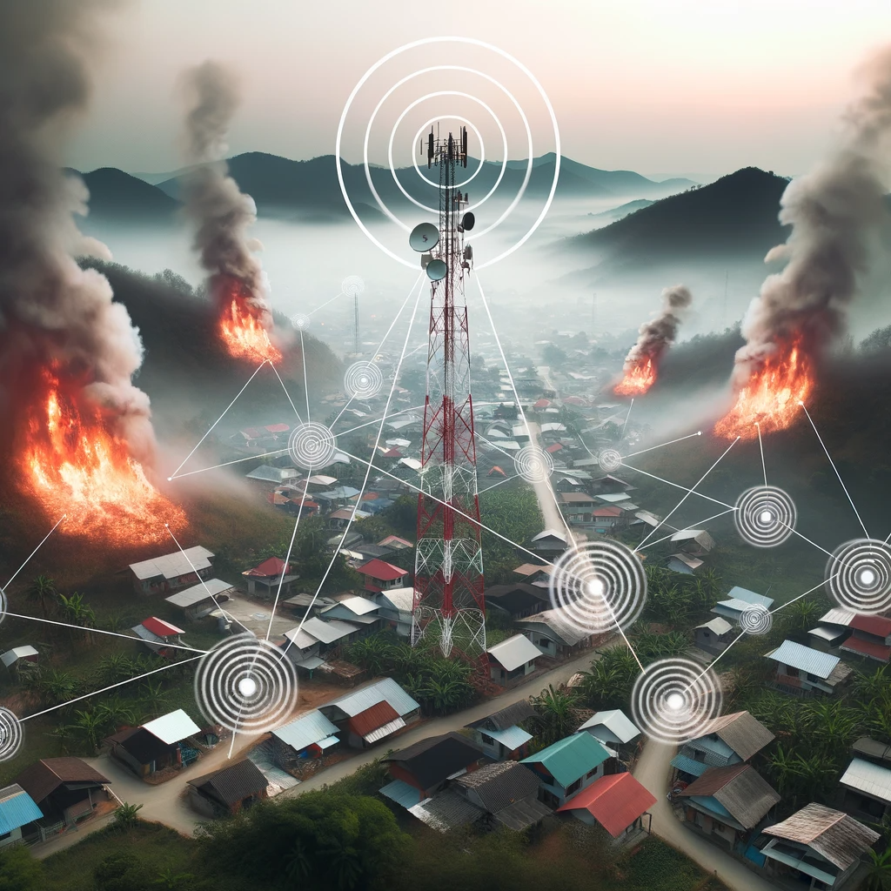

## Benefits

### Enhanced Community Safety
- Timely evacuation alerts.
- Inclusive access to alerts in remote areas with limited internet.

### Effective Resource Management
- Data-driven allocation of firefighting resources.
- Improved emergency response strategies.

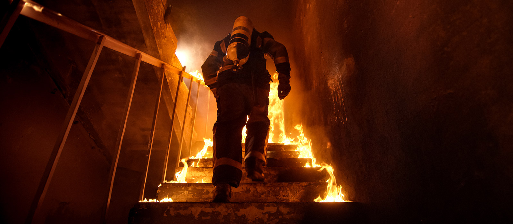

### Environmental Protection
- Proactive measures for habitat and biodiversity conservation.
- Reduced environmental impact from uncontrolled wildfires.

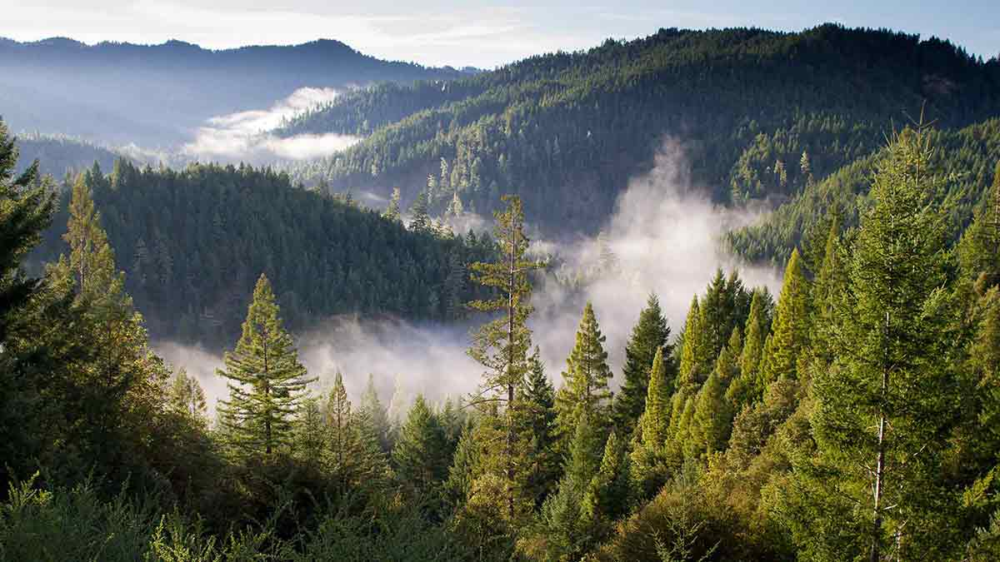

### Data-Driven Decision Making
- Enables comprehensive wildfire behavior analysis.
- Facilitates continuous model improvement and accuracy.

## Video

  

## 🔥 Wildfire Tracker Web Application

  

  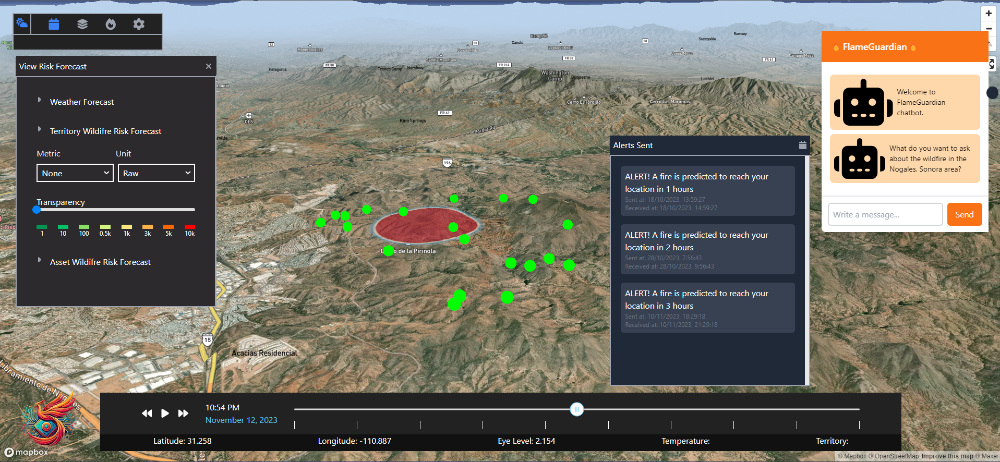

This web application provides a dynamic 3D mapping solution for monitoring and predicting wildfire spread in real-time. Using Mapbox's advanced terrain mapping, users can visualize the affected areas with precision, represented by an overlay on the map. The interactive timeline feature allows for playback of the fire's progression, giving invaluable insights for emergency response and evacuation planning.

## 🌟 Features

- **3D Terrain Visualization**: Realistic topography rendered using Mapbox to display current and predicted fire spread.
- **Time Control Playback**: Scrub through time to view the fire's trajectory at different stages.
- **Real-Time Alerts**: A dedicated panel lists the alerts sent, indicating the predicted time for the fire to reach key locations, enhancing situational awareness.
- **User Interface Controls**: Intuitive icons allow users to toggle map layers, tools, and access additional information.
- **Navigation Data Display**: Real-time updates on latitude, longitude, eye level, temperature, and territory for detailed monitoring.
- **Responsive Design**: Tailwind CSS ensures a mobile-friendly and responsive layout across all devices.
- **FlameGuardian Chatbot**: An interactive chatbot for users to ask questions and receive advice about wildfires, enhancing user engagement and providing valuable information.

## 🛠 Technologies

- **Mapbox**: For rendering 3D interactive maps.
- **Next.js**: A React framework that enables server-side rendering and generates the web app.
- **TypeScript**: For writing scalable, error-checked codebase.
- **CSS & JavaScript**: For styling and interactive elements.
- **NextAuth.js**: For authentication handling.
- **Prisma**: As the ORM for database transactions.
- **tRPC**: Enables end-to-end typesafe APIs.
- **Tailwind CSS**: For utility-first styling.
- **Vercel**: Platform for deploying and hosting the web application.

## 📖 Usage

The web app allows users to visualize fire spread in relation to the terrain and infrastructure. Green markers indicate points of interest, and the red overlay details the fire's current and predicted area. Use the time control to view the forecasted fire spread and check the alerts panel for real-time notifications regarding fire movement. In addition to visualizing fire spread and receiving real-time alerts, users can interact with the "FlameGuardian" chatbot. This feature allows users of all ages to ask specific questions regarding wildfires, like what actions to take if a fire is within 20 km. The chatbot can provide personalized advice, enhancing the app's educational and preventive capabilities.

For instance, a user concerned about an approaching wildfire can query the chatbot for safety measures, evacuation routes, or the status of the fire. The chatbot's integration into the application enriches the user experience by providing a quick and interactive way to access critical information, making the tool not only a monitoring solution but also a platform for education and awareness regarding wildfire safety and preparedness.

This application serves as a critical tool for communities and first responders to anticipate and react to wildfires, potentially saving lives and property by providing an advanced warning system.

## Emergency Response Handheld Device Prototype (ERHD)

In the prototype phase, we utilized Shapr3D to create a 3D model of our device, which takes the shape of a rectangular box. Housed within this box are a LoRa communication module and its corresponding antenna, responsible for receiving data. Additionally, the device is equipped with an auditory alarm system, activated by a buzzer, to alert users in the event of an approaching fire. A push button is also integrated into the design, allowing users to manually deactivate the alarm. Given that the target market for this product comprises communities without access to electrical infrastructure, the device incorporates a solar panel for energy harvesting and recharging. This ensures continuous operation by harnessing sunlight for power, converting it into stored energy, and facilitating effortless recharging of the device. 

## Emergency Response Handheld Device (ERHD) - Development Plan

  
The Emergency Response Handheld Device (ERHD) is under development as a cutting-edge aid for emergency scenarios, focusing particularly on wildfire monitoring. This outlines the intended features and functionalities of the ERHD, designed to support first responders and emergency teams in difficult environments.

### Planned Features

- **Dual-Display System**: Two screens are planned; the left for an interactive map indicating wildfires, and the right for communication and technical data.
- **High-Gain Antenna**: An antenna for long-range communication will be integrated to maintain reliable contact in remote locations.
- **User Interface**: Designed with tactile buttons for easy navigation through the device's functions.
- **Solar Charging**: A built-in solar panel will provide a sustainable power source.
- **Durable Construction**: Built to withstand tough field conditions.

### Implementation Steps

1. **Initial Charging**: Charge fully before deployment, using solar power or the provided charger.
2. **Device Activation**: Power on the device with a long press on the power button.
3. **Interface Navigation**: Buttons are designed for quick access to functions, even with gloves on.
4. **Communication Configuration**: The right screen will offer setup guidance for communication links.

### Intended Use and Care

- Avoid exposing the ERHD to water and extreme temperatures.
- Use only the provided charger to prevent damage to the solar panel.
- Check the antenna regularly for secure attachment and damage.

### Maintenance and Updates

- Keep the solar panel clean for efficiency.
- Store the device in a temperature-controlled environment when not in use.
- Apply software updates as they become available to ensure optimal performance and security.

---

**Note:** This device is in the development phase for the future.

## Dataset preparation

Data sources are mostly from https://firms.modaps.eosdis.nasa.gov/

| Data source           | Description  |
| --------------------- | ------------ |
| [MODIS](https://modis.gsfc.nasa.gov/)                 | The Moderate Resolution Imaging Spectroradiometer (MODIS) MCD43A4 Version 6 Nadir Bidirectional Reflectance Distribution Function (BRDF)-Adjusted Reflectance (NBAR) dataset is produced daily using 16 days of Terra and Aqua MODIS data at 500 meter (m) resolution. |
|  [Meteomatics API ](https://www.meteomatics.com/en/weather-api/?ppc_keyword=meterological%20api&utm_term=meterological%20api&utm_campaign=API+meteo+(ES)&utm_source=adwords&utm_medium=ppc&hsa_acc=5001518620&hsa_cam=9635976224&hsa_grp=100215817118&hsa_ad=434708210612&hsa_src=g&hsa_tgt=kwd-1201933814859&hsa_kw=meterological%20api&hsa_mt=p&hsa_net=adwords&hsa_ver=3&gclid=CjwKCAjwp8OpBhAFEiwAG7NaEq-V1ESSXXNOJ1XH_BgrMDWIYdz85rLabfjejVCP15mr3NMZNFlUuRoCtp4QAvD_BwE) | The Meteomatics Weather API provides a comprehensive range of weather data including current conditions, historical data, short-term and seasonal forecasts, as well as marine, environmental, and climate data. It offers tailored solutions with an emphasis on accuracy, speed, and ease of access, catering to a broad range of industry needs​. |
| [FIRMS active fire data](https://firms.modaps.eosdis.nasa.gov/) | The Fire Information for Resource Management System (FIRMS) distributes Near Real-Time (NRT) active fire data within 3 hours of satellite observation from the Visible Infrared Imaging Radiometer Suite (VIIRS) aboard S-NPP and NOAA 20 at 375 meter (m) resolution. |
| [Copernicus DEM](https://registry.opendata.aws/copernicus-dem/) | Digital Surface Model (DSM) which represents the surface of the Earth including buildings, infrastructure and vegetation.. |

## Instructions to Run Models  

### How to run [Convolutional Neural Network + LSTM Model](https://github.com/jbric16/FlameForecast_Project/tree/main/deep_learning)

1. The notebook is executable on Google Colab, a cloud computing platform that offers a free Jupyter Notebooks environment. No additional configuration is needed for most cases, as Google Colab comes pre-installed with many data science and machine learning libraries.
2. [DataSets](https://github.com/jbric16/FlameForecast_Project/tree/main/deep_learning/Datasets) for the notebook to work correctly, you only need to load two specific data sets. You can do this using Google Colab's file import capabilities or upload them from Google Drive if they are stored there.

#### Area to be analyzed 

Popular Python libraries such as matplotlib, seaborn, pandas, and numpy are used for data analysis and visualization. Additionally, the machine learning model implements convolutional neural networks (CNN) and long short-term memory networks (LSTM). The notebook starts by importing these libraries and loading the data set from a CSV file. The data is then binned into 6-hour time intervals to facilitate subsequent analysis.

    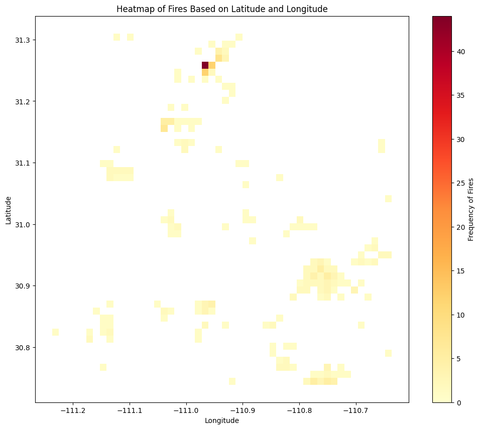
  </a>

Above: All the wildfires in the zone of Nogales, Sonora from 2016 to 2023 

The notebook is designed to predict the path of fires in a specific area of ​​Nogales, Sonora, covering a sampling area of ​​64 km x 64 km, as you can see in figure 1. The data, which ranges from 2016 to 2023, comes from the FIRMS system (Fire Information for Resource Management System). 

Figure 1. Nogales Zone

  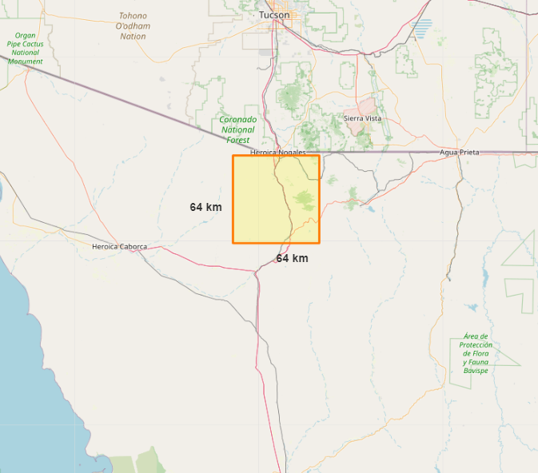
  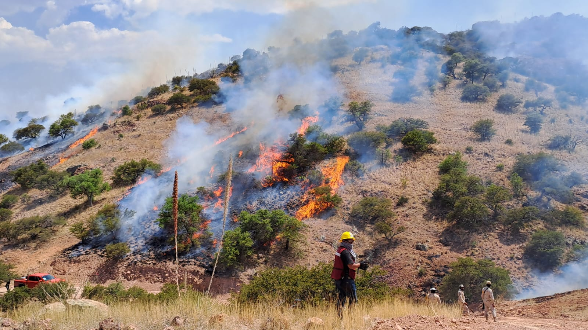

#### Data quality

In the study of fires and climate conditions, certain variables show considerable variation, making them potentially important factors to consider. For instance, 'Brightness' and 'FRP (Fire Radiative Power)' in the fire dataset, along with 'Apparent Temperature', 'Heat Index', and 'Humidity' in the climate dataset, exhibit a wide range of values, suggesting they could be good indicators of fire intensity and atmospheric conditions, respectively. Conversely, variables like 'Scan' and 'Track' in the fire dataset, as well as 'Precipitation' in the climate dataset, display less variation, possibly indicating their limited utility in differentiating fires or assessing their likelihood. Meanwhile, variables such as 'Confidence' and 'Temperature' in the fire data, along with 'Wind Speed' and 'Wind Direction' in the climate data, also show notable variation, hinting at their relevance in evaluating the confidence level in fire detection and understanding fire spread.

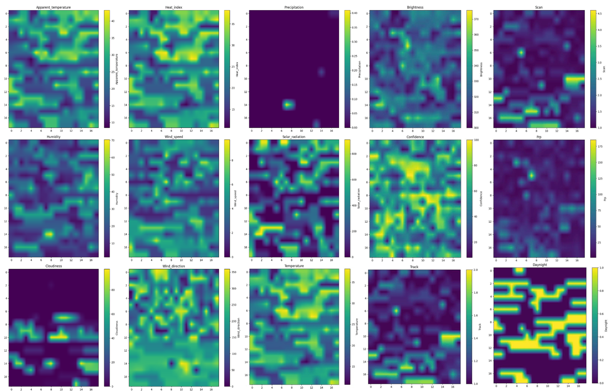

### Dataset
For deep learning model training, the dataset is a CSV file. The CSV are split approximately into 2 subsets for model training (80%) and validation (20%). We use the following feature as input to train the model:

- Fire

The target output depends on how the data has been entered, if each matrix in the sequence represents one day of data, then the prediction would be for the next day based on the previous 4 days.

#### Model training

- The model, which is a combination of Convolutional Neural Networks (CNN) and Long Short Term Memory (LSTM) Neural Networks, was trained using the Adam optimization algorithm. The binary cross-entropy loss function was minimized over 20 epochs with a batch size of 5. Additionally, techniques such as early stopping and learning rate reduction were implemented to improve training efficiency.

- The input variables are sequences of 5 64x64 grayscale images. These images represent geospatial and temporal data and are processed by the Convolutional and LSTM layers of the model. The images were normalized and the data set was split into 80% for training and 20% for validation.

- The binary cross entropy loss function was optimized during training. This function is typically used in binary classification problems and is particularly suitable for this Convolutional and LSTM model.

- The model makes predictions for a period of 5 time steps. The temporal interpretation of these steps depends on how the data was entered. For example, if each array in the sequence represents one day of data, then the prediction would be for the next day based on the previous 4 days.

- To evaluate the performance of the Convolutional and LSTM model, precision and completeness (recall) metrics were used on the validation set, as well as "No-fire Precision" and "No-Fire Recall" to evaluate the model's ability to correctly predict non-fire areas.

- The binary cross-entropy loss function was used, which is consistent with the binary classification nature of the problem and the Convolutional and LSTM design of the model.
 
 - Once the Convolutional and LSTM model was trained, predictions were generated for the validation set. Precision and completeness metrics were calculated to evaluate its performance. The resulting values ​​were a precision of 82.35% and a completeness of 74.14%.

The model pays special attention to the most recent information, as evidenced by the relationship between "Original Time 4" and "Actual Prediction 5." This feature is essential in situations where the most recent data is the most relevant for making predictions. The model's prediction, as seen in "Actual Prediction 5", appears to filter out and smooth out some of the noise present in the original images. This can be useful in identifying areas of primary interest and eliminating potential false alarms.

    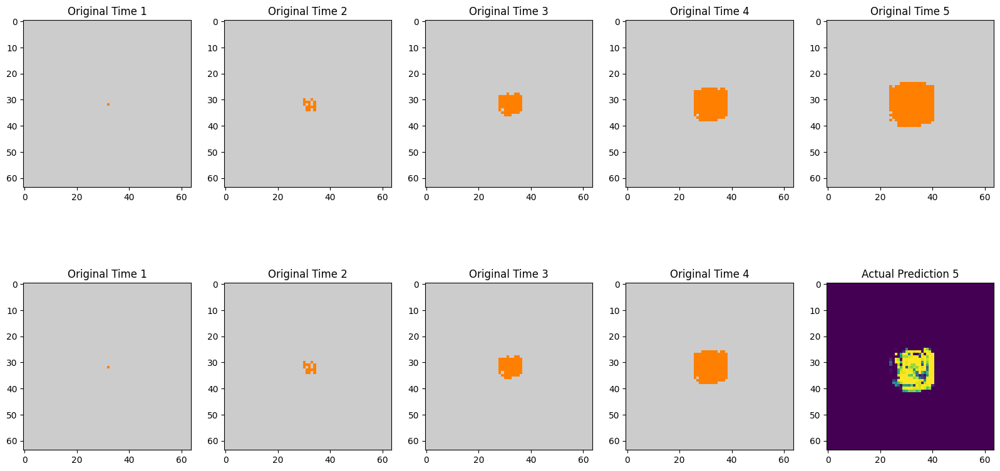
  </a>

#### Model evaluation

The validation data subset is utilized to assess the ConvLSTM model's performance on data. This allows us to compare the results with other models and check if the model is doign corrdtc. Below are the performance metrics.

| Metric        | Fire Precision | Fire Recall | No-Fire Precision | No-Fire Recall |
|---------------|---------------|------------|-------------------|----------------|
| ConvLSTM      | 0.92          | 0.75       | 0.99              | 0.99           |

#### Future Work

- AutoML Pipelines – Deploy AutoML pipelines to improve efficiency in model architecture and hyperparameter testing.

- Add more data: Expand the data set to improve the robustness and accuracy of the model.

- Train the model with more layers: Experiment with deeper model architectures to capture more complex features.

- Put it into production: Deploy the model in a production environment to evaluate its effectiveness in real-world scenarios.

### How to run [Random Forest Model](https://github.com/jbric16/FlameForecast_Project/tree/main/Notebooks)

1. [Download data set](https://www.kaggle.com/datasets/fantineh/next-day-wildfire-spread) This dataset is a comprehensive, multivariate compilation of historical wildfires in the United States over nearly a decade. It merges two-dimensional fire data with a rich set of explanatory variables like topography, weather, and vegetation, making it an ideal resource for machine learning applications. It comprises 18,445 samples, each representing a 64 km x 64 km region where a fire occurred. The dataset includes 'fire' vs. 'no fire' labels, with an extra category for uncertain labels. To study fire propagation, it contains both the previous day's fire mask and the current day's fire mask. Using Google Earth Engine, data from various sources are collated and layered with relevant variables for wildfire prediction, including elevation, temperature, humidity, and more. This dataset is invaluable for developing wildfire propagation models based on remote sensing data with a one-day lead time.

Examples from the data set as variables

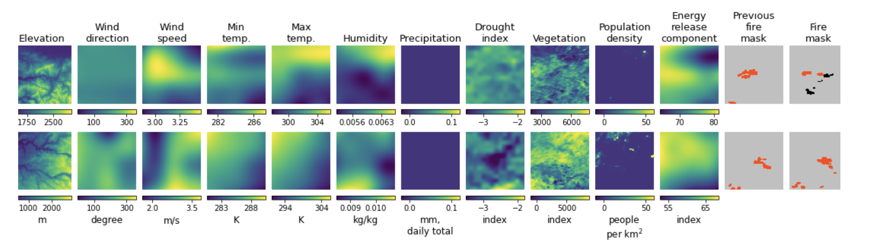

## Models Comparisson

| Metric        | Fire Precision | Fire Recall | No-Fire Precision | No-Fire Recall |
|---------------|---------------|------------|-------------------|----------------|
| ConvLSTM      | 0.92          | 0.75       | 0.99              | 0.99           |
| RandomForest       | 0.30          | 0.44       | 0.98              | 0.97           |

## LoRa Communication

  

First, let's clarify the distinction between LoRa and LoRaWAN:

LoRa is a wireless modulation technique derived from Chirp Spread Spectrum (CSS) technology, which encodes information into radio waves.

  

LoRaWAN, on the other hand, is a Medium Access Control (MAC) layer built on top of LoRa. It serves as a network architecture that enables interconnection, bidirectional communication, and scalability.

When we combine these two technologies, we create a communication system that operates without the need for an internet connection. LoRa gateways and end devices make this possible. Within the gateway's range, a bidirectional message can be transmitted via LoRa radio waves. Subsequently, the gateway operates through LoRaWAN to facilitate the transmission or reception of information to and from the network and application server.

The LoRa architecture seamlessly enables communication with our end node, which functions as an alert receiver equipped with an Arduino, operating within the 863-923 MHz frequency range. Within this operational framework, our application server efficiently manages the processing of HTTP requests generated by our model, directing them to the network server. The LoRaWAN network server establishes a communication channel with a LoRa gateway. This gateway exclusively employs LoRa RF radio waves, utilizing chirp pulses, and plays a pivotal role in transmitting messages.

To further enhance our non-Internet communication capabilities, we've implemented a network of three LoRa Gateways, effectively serving as signal repeaters. These gateways collaborate to extend the reach of Node End devices, acting as receivers, allowing them to transmit messages across distances of up to 45 kilometers without reliance on an internet connection, solely harnessing the capabilities of LoRa RF technology.

## Fire Prediction System Architecture: A Future Plan

  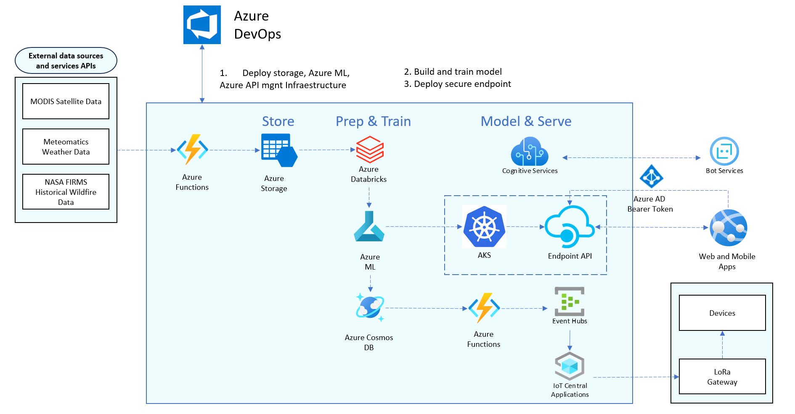

The above architecture outlines an integrated system designed to proactively manage fire predictions and effectively communicate potential risks, combining sophisticated data processing and machine learning with direct communication to affected populations.

The fire prediction system architecture is designed as a robust and advanced technological solution that leverages a myriad of modern data processing, machine learning, and communication technologies. Here's a detailed walkthrough of the envisioned plan:

## Phase 1: Data Collection and Storage

### External Data Sources
Data is collected from various sources to ensure accuracy and reliability:
- **MODIS Satellite Data**: Identifies potential fire activity areas.
- **Meteomatics Weather Data**: Provides vital information for understanding fire behavior.
- **NASA FIRMS Historical Wildfire Data**: Offers historical insights for model training.

### Azure Functions
These are utilized for the automated collection and preliminary processing of data.

### Azure Storage
Serves as a secure, scalable, and reliable data storage solution.

## Phase 2: Data Processing and Model Training

### Azure Databricks
Handles data transformation and preparation for machine learning model training.

### Azure ML (CNN + LSTM)
Employs a hybrid model combining convolutional neural networks and LSTM for interpreting satellite imagery and sequential data patterns.

### Azure Cosmos DB
Stores the machine learning model's data, making it available for real-time querying.

## Phase 3: Model Deployment and Interface Services

### Cognitive Services
Utilized to provide advanced AI capabilities for data and image analysis and to enhance user interactions with natural language processing.

### AKS (Azure Kubernetes Service)
Hosts and manages the model prediction containers, ensuring scalable and resilient service delivery.

### Endpoint API
Acts as the gateway for applications to access predictions from the machine learning model.

### Event Hubs
Manages real-time data and event streams for dynamic updates.

### IoT Central Applications
Facilitates efficient communication with IoT devices, including LoRa devices, for alert transmissions.

## Phase 4: User Interaction and Alerts

### Bot Services
Powered by Azure Cognitive Services for an interactive, user-friendly experience, allowing for context-aware dialogues and information dissemination.

### Web and Mobile Apps with 3D Map
Provides a user interface in the form of a web or mobile app, featuring a 3D map that visualizes fire predictions.

### LoRa Devices
Creates a network to communicate with remote communities for timely fire alerts, even in areas with limited internet connectivity.

---

The  components are planned for future implementation to complete the architecture.

## Business Model
Click to check business model: https://miro.com/welcomeonboard/QWl0OWd2UUFpNGNvZGNyc2VWYXE2eWloV0gySkljT3NVSlFpb3RPeXpqcXhrMTI5UWFtamN3dXc4TGxiWFhVc3wzMDc0NDU3MzUwNTYyMDUwNTE4fDI=?share_link_id=428474196356

  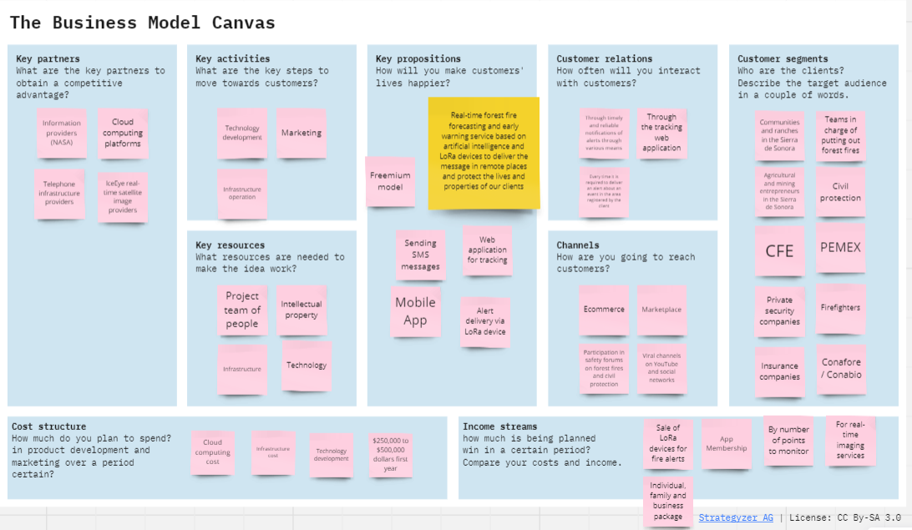

## Future

1. **Satellite Network Implementation**:
In the future, our plan is to implement a network that harnesses both LEO and GEO satellites, providing a dual-layered approach to monitor and detect wildfires globally with unprecedented precision.

2. **Data Management and Expansion Strategy**:
We will design and establish an adaptable economic model, intended to seamlessly process and integrate the influx of data from our satellite network into a cutting-edge machine learning algorithm.

3. **Strategic Government Alliances**:
Looking ahead, we intend to collaborate with government agencies, with the aim of incorporating our technology into national emergency response strategies to provide real-time alerts for wildfires, thereby enhancing public safety and environmental protection.

4. **Global Expansion Framework**:
As part of our future strategy, we plan to scale our operations beyond the initial implementation in Nogales, Sonora, aiming to refine and adapt our model for global applicability. This will involve retraining our machine learning algorithms with diverse datasets to ensure accuracy and effectiveness in a variety of ecosystems and topographies around the world.

5. **Communication Infrastructure Enhancement**:
In the future, we also plan to integrate SMS (Short Message Service) technology into our alert system. This will enable us to send immediate fire alerts directly to individuals and communities at risk, regardless of their internet connectivity, thereby broadening the reach and impact of our emergency response measures on a global scale.

## File Descriptions 
* [LoRa](https://github.com/jbric16/FlameForecast_Project/tree/main/LoRa): This section is dedicated to the implementation of LoRa technology in conjunction with Arduino and the Helium network. Its primary function is to serve as an alert receiver. Within this directory, you will find two key files: a .ino file designed for Arduino simulation, and another .ino file tailored for the implementation of LoRa WAN connectivity via the Helium network.

* [Notebooks](https://github.com/jbric16/FlameForecast_Project/tree/main/Notebooks): This section comprises two pivotal notebook files, each designed for specific tasks. One is engineered to execute next-day fire predictions using the Random Forest model, while the other is tailored for the implementation of Convolutional Neural Networks (CNN) combined with Long Short-Term Memory (LSTM) models for advanced forecasting.

## Document or report 

## Languages, frameworks, platforms, APIs, & other technologies used

- Python 3 used for processing, modelling and visualization
- Scikit for feature importance visualisation
- Deep learning used Keras/tensorflow
- https://firms.modaps.eosdis.nasa.gov/ for VIIRS fire data
- https://eod-catalog-svc-prod.astraea.earth/ for MODIS data
- Git & github used for version control of code

## Team members & their contributions

Note that each team member helped in contribuitng with all this. 

- [Hector Gutierrez](https://github.com/HectorGtz27)
- [Jose Briceño](https://github.com/jbric16)
- [Camila Rodriguez](https://github.com/camilardgzm)
- [Mariana Garcia](https://github.com/marianaagrcg)
- [Cesar Silva](https://github.com/casrhub)
- [Daniel Barreras](https://github.com/DanielBrMz)

